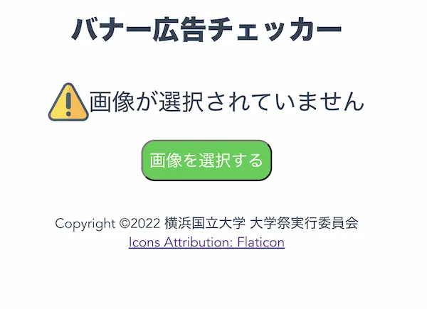
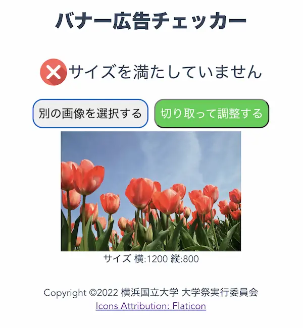
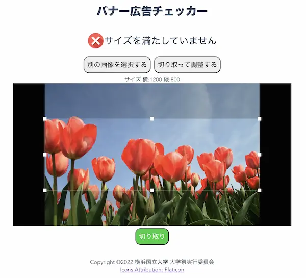
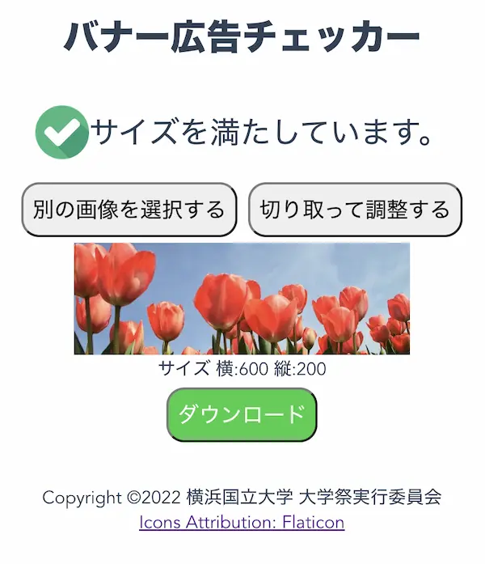

# 学祭バナー広告チェッカー

> 制作期間: 07/15/2022~07/15/2022
>
> https://ad-check.ynu-fes.yokohama/ で運用中

## 概要

画像が学祭のバナー広告の要件である600×200を満たしているかを確認するサイトです。

600×200を満たしていない場合には切り取りを行うことで600×200に調整することができます。

超短期間での開発のため機能は最小限です。

## スクリーンショット

最初の画面。



画像をアップして規定のサイズでない場合はエラー



切り取って調整するというボタンを押すと`Vue Advanced Cropper`で編集モードになる。



切り取った後は自動的に規定のサイズに合うように調整される。

編集後はダウンロードが可能。



## 使用しているライブラリ/フレームワーク

- Vue3
- Vue Advanced Cropper

### Compiles and hot-reloads for development

```
pnpm install
pnpm run serve
```
